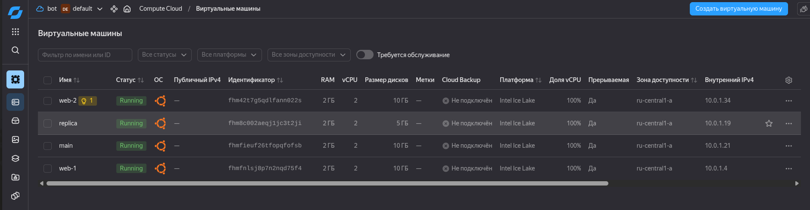
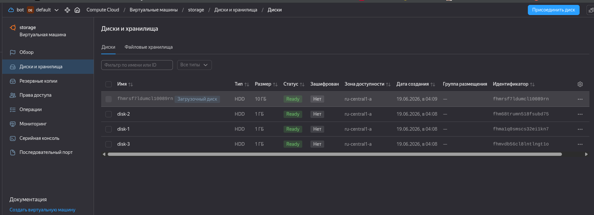
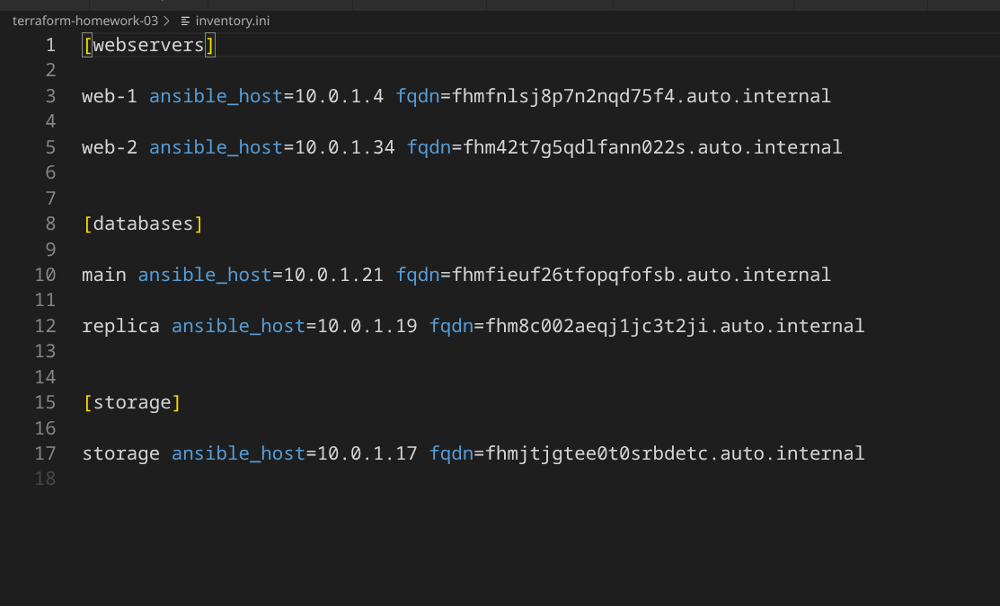

# Домашнее задание к занятию «Управляющие конструкции в коде Terraform» - Шаров Олег

## Задание 1

Скриншот входящих правил группы безопасности:

## Задание 2

Созданы файлы:
- `count-vm.tf` - создание 2 ВМ web-1 и web-2 с помощью `count`
- `for_each-vm.tf` - создание 2 ВМ для БД (main и replica) с помощью `for_each`

Скриншот созданных ВМ:

## Задание 3

Созданы 3 одинаковых виртуальных диска размером 1 Гб с помощью ресурса `yandex_compute_disk` и мета-аргумента `count`.

Создана одиночная ВМ с именем "storage" с использованием блока `dynamic secondary_disk{..}` и мета-аргумента `for_each` для подключения дополнительных дисков.

**Файл:** `disk_vm.tf`

**Особенности:**
- Использован `count = 3` для создания дисков
- Применен `dynamic` блок для динамического подключения дисков к ВМ
- Использован splat-expression `[*]` для получения списка ID дисков

Скриншот подключенных дисков:

## Задание 4

Создан динамический inventory-файл для Ansible с использованием функции `templatefile` и файла-шаблона `hosts.tftpl`.

**Файлы:**
- `ansible.tf` - ресурс для генерации inventory
- `hosts.tftpl` - шаблон inventory файла

**Особенности:**
- Инвентарь содержит 3 группы: `webservers`, `databases`, `storage`
- Динамически обрабатывает любое количество ВМ в группах
- Добавлена переменная `fqdn` для каждой ВМ
- Использованы внутренние IP-адреса (так как `nat = false`)

**Группы ВМ:**
- `[webservers]` - 2 ВМ (web-1, web-2) из задания 2.1
- `[databases]` - 2 ВМ (main, replica) из задания 2.2
- `[storage]` - 1 ВМ (storage) из задания 3.2

Скриншот полученного файла:

